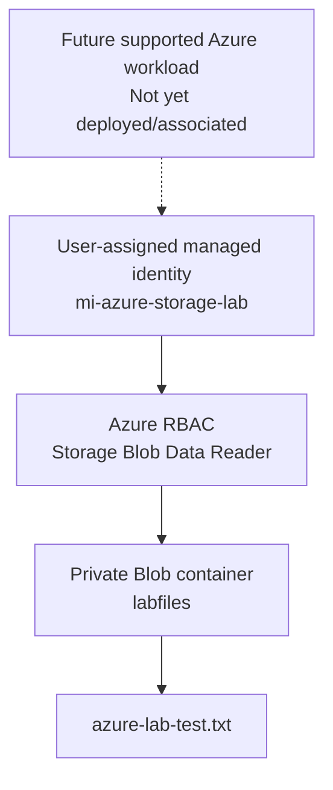

# Azure Managed Identity & Blob Storage RBAC Lab

## Overview
This hands-on lab demonstrates how to create a **user-assigned managed identity** and grant it **least-privilege Azure RBAC access** to a private Azure Blob Storage container.

**Status:** Identity creation and RBAC assignment **verified**. Workload association and token-based blob access **not yet tested**.

## Learning objectives
- Distinguish identity (who), role (what), and scope (where).
- Create a user-assigned managed identity.
- Grant `Storage Blob Data Reader` at the container scope, rather than the entire storage account.
- Verify role assignments from both the container and identity views.
- Recognize that a role assignment does not itself prove a workload can authenticate or access data.

## Lab resources

| Resource | Name / configuration |
|---|---|
| Resource group | `rg-azure-network-lab` |
| Region | East US |
| Storage account | `stazurenetworklab` |
| Blob container | `labfiles` (private) |
| Test blob | `azure-lab-test.txt` |
| User-assigned managed identity | `mi-azure-storage-lab` |
| RBAC role | `Storage Blob Data Reader` |
| RBAC scope | `labfiles` container only |

## Architecture

The dashed line represents **future work**, not a completed connection. The RBAC assignment exists, but no associated workload was shown in the portal.

## Implementation

1. Opened the Azure portal and confirmed the existing user-assigned managed identity `mi-azure-storage-lab`.
2. Navigated to **Storage accounts → stazurenetworklab → Containers → labfiles → Access control (IAM)**.
3. Selected **Add role assignment** and chose **Storage Blob Data Reader**.
4. On **Members**, chose **Managed identity → User-assigned managed identity → mi-azure-storage-lab**.
5. Reviewed and submitted the assignment at the **`labfiles` container scope**.
6. Verified the assignment in **labfiles → Access control (IAM) → Role assignments**.
7. Independently verified the same assignment in **mi-azure-storage-lab → Azure role assignments**.
8. Checked **mi-azure-storage-lab → Associated resources (preview)**. The portal displayed **No resources**.

## Verified results

| Check | Result |
|---|---|
| User-assigned managed identity exists | Verified |
| `Storage Blob Data Reader` assigned to managed identity | Verified |
| Role scope limited to `labfiles` | Verified |
| Assignment visible from container IAM | Verified |
| Assignment visible from identity's Azure role assignments | Verified |
| Associated resources shown in portal | None |
| Managed identity token acquisition by workload | Not tested |
| Blob read using managed identity | Not tested |
| Blob write denied using managed identity | Not tested |

## Security observations
- The `labfiles` container is **private**, meaning anonymous public blob access is not allowed. Properly authorized identities can still access data.
- `Storage Blob Data Reader` permits blob read/list operations, not blob uploads or deletes.
- Container-level scope limits the assignment to `labfiles`; it does not grant the same data role to sibling containers.
- **Authentication is not authorization**: a workload must use the identity to obtain an access token, and the service must authorize the requested operation.
- The portal's **Access key** / **Microsoft Entra user account** selection concerns the signed-in human portal session; it does not test the managed identity.

## Screenshots to add
Save sanitized screenshots under `screenshots/`:

1. `01-managed-identity.png` — Managed identity listing or overview.
2. `02-container-role-assignment.png` — `labfiles` IAM role assignments showing the managed identity and role.
3. `03-identity-role-assignment.png` — Managed identity's Azure role assignments page.
4. `04-associated-resources.png` — Associated resources page showing **No resources**.

**Before publishing:** Crop or blur account email, display name if desired, tenant and subscription IDs, object/principal IDs, request IDs, and any tokens or keys. Never commit credentials or access keys.

## Next steps
- Evaluate a supported, low-cost workload for attaching the user-assigned managed identity.
- Use the workload to obtain a token and attempt an authorized read from `labfiles`.
- Verify a write attempt is denied with the Reader role.
- Document observed test output and any Azure charges.
- Clean up lab resources when finished to avoid ongoing costs. Deleting `rg-azure-network-lab` will also delete **other resources in that resource group**, so review its contents first.

## Cost notes
Azure storage capacity and operations may incur charges. No VM was deployed for this identity test. A managed identity RBAC assignment alone is **not** evidence of an application access test.
